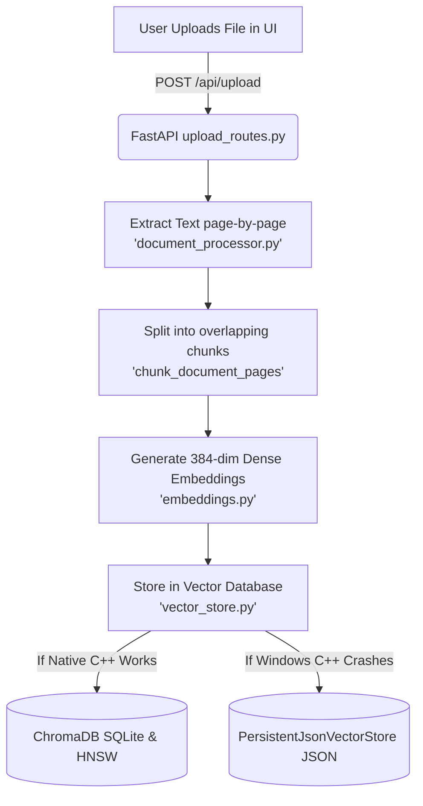
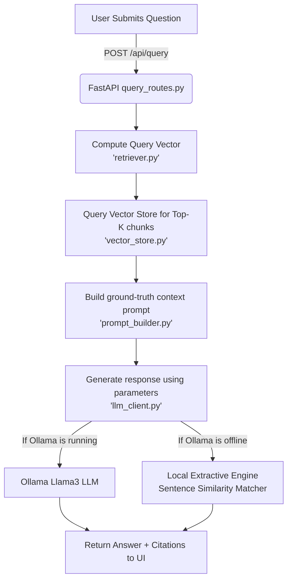

# Smart Document Assistant - Comprehensive Project Analysis & Workflow

This document provides a detailed breakdown of the folder structure, files, pipeline architecture, and execution code paths of the **Smart Document Assistant** application.

---

## 1. Project Directory Structure

Here is a tree representation of the project folders and files:

```text
Smart docs/
├── .env                       # Local environment configurations (Port, Model, Host overrides)
├── .env.example               # Template showing required environment variables
├── main.py                    # Root entrypoint of the FastAPI web application
├── requirements.txt           # Python package dependencies
├── app/                       # Core backend application package
│   ├── __init__.py            # Python package initialization
│   ├── config.py              # Configuration manager reading env variables & setting defaults
│   ├── modules/               # RAG pipeline logic modules
│   │   ├── __init__.py        # Exposes helper functions to the wider application
│   │   ├── document_processor.py # Handles file text extraction and semantic chunking
│   │   ├── embeddings.py      # Generates 384-dimensional semantic dense vector representations
│   │   ├── llm_client.py      # Connects to Llama LLM via Ollama (with pure-Python fallback)
│   │   ├── mcp_stub.py        # Mock interfaces for Model Context Protocol integrations
│   │   ├── prompt_builder.py  # Builds context-grounded prompt templates for generation
│   │   ├── retriever.py       # Retrieves relevant database chunks using query vectors
│   │   └── vector_store.py    # Manages local ChromaDB and PersistentJsonVectorStore fallback
│   └── routes/                # FastAPI web routes/endpoints
│       ├── __init__.py        # Route package initialization
│       ├── query_routes.py    # Route handling user queries and hyperparameter execution
│       └── upload_routes.py   # Route handling document upload, indexing, and management
├── data/                      # Persistent database directory
│   └── chroma_db/             # Local database file storage
│       ├── chroma.sqlite3     # SQLite DB for collection metadata
│       ├── smart_document_assistant.json # Pure-Python fallback vector store database
│       └── [uuid directories] # HNSW index files (managed by ChromaDB C++ binaries)
├── docs/                      # Architectural and API documentation files
│   └── ProjectAnalysis.md     # This comprehensive analysis file
└── frontend/                  # Static SPA (Single Page Application) frontend files
    ├── index.html             # UI HTML layout (drag-and-drop area, sliders, chat box)
    ├── css/
    │   └── style.css          # Premium modern UI styling (gradients, animations, glassmorphism)
    └── js/
        ├── app.js             # Core frontend controller (handles UI state, API calls, event listeners)
        └── markdown.js        # Formats markdown syntax inside the chat responses
```

---

## 2. Component-by-Component File Analysis

### Root Configurations & Entrypoint
*   **[.env](file:///c:/Users/GopiChandGarikapati/Desktop/Smart%20docs/.env)**: Stores parameters such as `PORT`, `HOST`, `OLLAMA_HOST` (e.g. `http://localhost:11434`), and `OLLAMA_MODEL_NAME` (e.g. `llama3`).
*   **[main.py](file:///c:/Users/GopiChandGarikapati/Desktop/Smart%20docs/main.py)**: Initializes the `FastAPI` instance. It:
    1. Registers CORS middleware (`CORSMiddleware`) to allow frontend communication.
    2. Mounts the `frontend/` directory to serve static assets and `index.html` at the `/` root route.
    3. Registers the API routers from the `app/routes/` package.
    4. Starts the `uvicorn` web server.

### Application Routes (`app/routes/`)
*   **[upload_routes.py](file:///c:/Users/GopiChandGarikapati/Desktop/Smart%20docs/app/routes/upload_routes.py)**: Exposes endpoints for managing files:
    *   `POST /api/upload`: Receives uploaded documents, saves them to `data/uploads/`, extracts text, chunks them, generates embeddings, and indexes them.
    *   `GET /api/documents`: Lists unique indexed source filenames.
    *   `DELETE /api/documents/{filename}`: Removes a document's chunks from the vector database.
    *   `DELETE /api/documents`: Wipes all documents from the store.
*   **[query_routes.py](file:///c:/Users/GopiChandGarikapati/Desktop/Smart%20docs/app/routes/query_routes.py)**: Exposes the core query interface:
    *   `POST /api/query`: Receives a JSON body with the `question` and optional sliders (`temperature`, `top_p`, `top_k`). Executes the RAG pipeline and returns the generated answer and retrieved citation snippets.

### Core Modules (`app/modules/`)
*   **[config.py](file:///c:/Users/GopiChandGarikapati/Desktop/Smart%20docs/app/config.py)**: Sets up directory constants (like upload and database folders) and loads environment variables, providing default fallbacks if `.env` variables are missing.
*   **[document_processor.py](file:///c:/Users/GopiChandGarikapati/Desktop/Smart%20docs/app/modules/document_processor.py)**: Reads raw files (PDFs, DOCX, CSV, TXT, JSON, Logs) and extracts plain text page-by-page. Contains `chunk_document_pages` which splits text into overlapping semantic segments of `CHUNK_SIZE` characters (default 600) with a `CHUNK_OVERLAP` (default 100) to keep sections connected semantically.
*   **[embeddings.py](file:///c:/Users/GopiChandGarikapati/Desktop/Smart%20docs/app/modules/embeddings.py)**: Generates 384-dimensional dense floating-point vector representations for text. It loads the `all-MiniLM-L6-v2` model from `SentenceTransformers`. If PyTorch or DLL imports fail, it falls back to `_generate_dense_fallback_embedding` which hashes characters, bigrams, and trigrams into a normalized 384-dimensional vector space.
*   **[vector_store.py](file:///c:/Users/GopiChandGarikapati/Desktop/Smart%20docs/app/modules/vector_store.py)**: Handles storage and retrieval. It probes if native ChromaDB runs successfully. If it fails (such as C++ `hnswlib` segfaults on Windows), it switches the system to **`PersistentJsonVectorStore`**, which runs pure-Python Cosine Similarity calculations over vectors saved in `data/chroma_db/smart_document_assistant.json`.
*   **[retriever.py](file:///c:/Users/GopiChandGarikapati/Desktop/Smart%20docs/app/modules/retriever.py)**: Generates a vector representation of the user query and queries the active vector store for the top matches.
*   **[prompt_builder.py](file:///c:/Users/GopiChandGarikapati/Desktop/Smart%20docs/app/prompt_builder.py)**: Combines the user query with the retrieved source snippets to construct a structured prompt payload.
*   **[llm_client.py](file:///c:/Users/GopiChandGarikapati/Desktop/Smart%20docs/app/modules/llm_client.py)**: Interacts with the local Llama model via `Ollama`. If Ollama is offline or unavailable, it falls back to the **Local Extractive RAG Engine** (`_local_extractive_generation`) to extract relevant matching sentences directly from the document without making external calls.

---

## 3. The RAG Pipeline Workflow

The project consists of two core workflows: **The Document Ingestion (Index) Workflow** and **The Query (Retrieval-Generation) Workflow**.

### Workflow A: Document Ingestion (Index) Pipeline

When a user uploads a document:


*   **Execution Code Path:**
    1. `upload_routes.py: L108-111`: Saves file to `data/uploads/`.
    2. `document_processor.py: extract_text_from_file()`: Determines extension and extracts text.
    3. `document_processor.py: chunk_document_pages()`: Loops through text pages and builds chunk dictionaries containing text and metadata (source file, page number).
    4. `embeddings.py: generate_batch_embeddings()`: Computes vectors.
    5. `vector_store.py: add_chunks_to_vector_store()`: Writes text chunks, metadata, and embeddings to either ChromaDB or the JSON fallback database.

---

### Workflow B: Query (Retrieval-Generation) Pipeline

When a user asks a question in the chat bar:


*   **Execution Code Path:**
    1. `query_routes.py: ask_question()`: Receives payload (question, temperature, top_p, top_k).
    2. `retriever.py: retrieve_relevant_chunks()`: Generates the vector embedding of the query and runs a similarity lookup against the active vector database (using C++ HNSW or the fallback pure-Python Cosine calculation).
    3. `prompt_builder.py: build_rag_prompt()`: Takes the top retrieved matching snippets and builds the instruction prompt containing the context.
    4. `llm_client.py: generate_llm_response()`:
        *   Tries to connect to Ollama using `_call_local_ollama()`.
        *   If it fails, runs the fallback **`_local_extractive_generation()`** which parses, ranks, and filters candidate sentences based on the query tokens, and applies the user's `temperature` and `top_p` parameters to perturb scores and retrieve a dynamic subset of output sentences.
    5. `query_routes.py: L123-145`: Compiles response metadata, computes elapsed time, and returns a JSON payload to the UI containing the final text answer and citation sources.

---

## 4. Hyperparameter Adjustments (sliders)
*   **`top_k`**: Controls retrieval density. It specifies how many document chunks are retrieved from the database to construct the prompt context.
*   **`temperature`**: Controls randomness. In Ollama, it controls the next-token probability distribution. In the fallback local extractive engine, it adds random perturbations to sentence scores to change which matched sentences are prioritized.
*   **`top_p`**: Nucleus sampling parameter. In Ollama, it filters tokens dynamically. In the fallback extractive engine, it performs nucleus filtering on the candidate sentences to truncate low-confidence matches.
